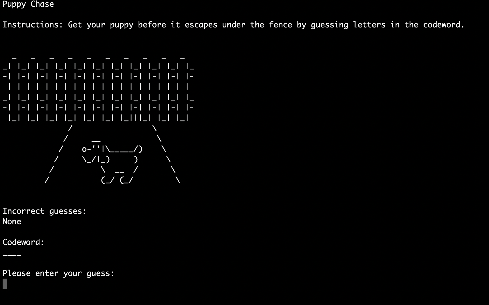
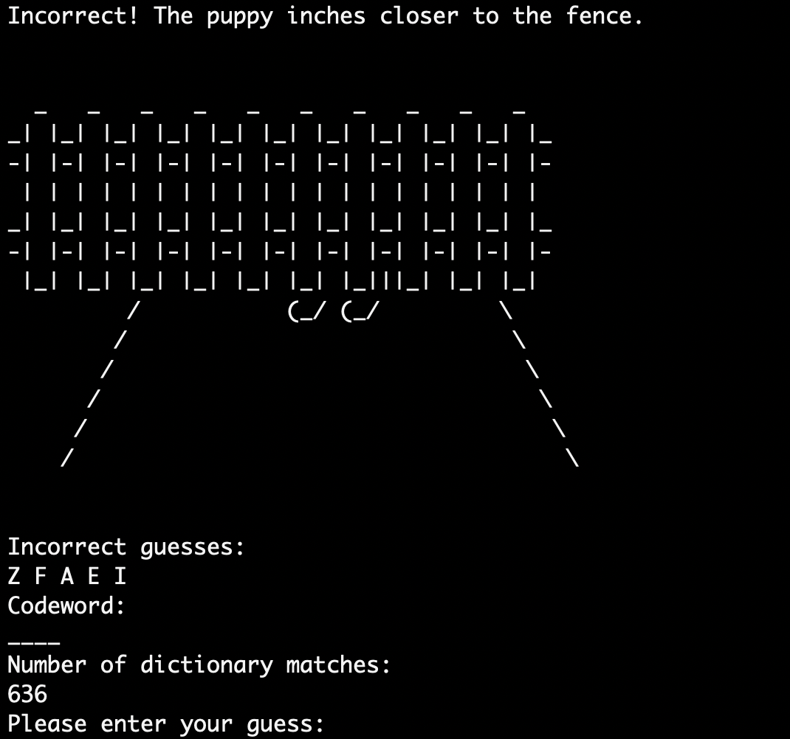
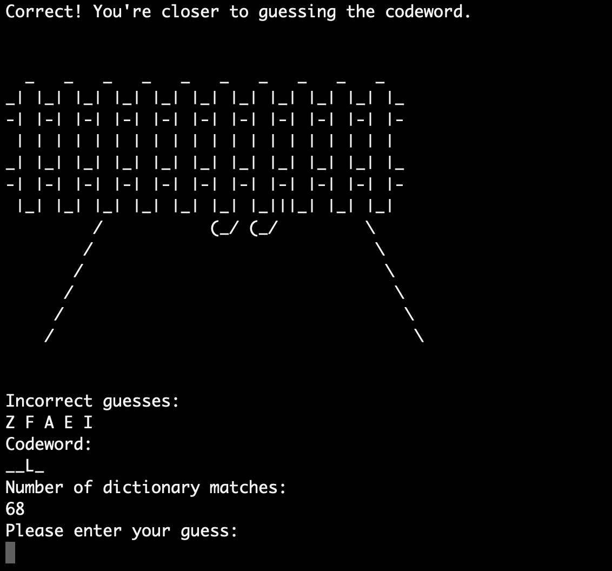

# Puppy Chase

Guess one letter at a time of a codeword, represented by blank placeholders for each letter, to catch your puppy before it escapes under your fence.

### Prerequisites

You will need to install python 3.7 to run this program.

### Running the Script
On the terminal, cd into the file directory of the program.
To run the script: `python3 pupChase.py`

## Image Walkthrough 

Users will be able to see their incorrect guesses, progress on the codeword, and number of dictionary matches from noun.py based on the correctly/incorrectly guessed letters.

## Built With

* [Python3](https://www.python.org/downloads/release/python-370/) - The language used

